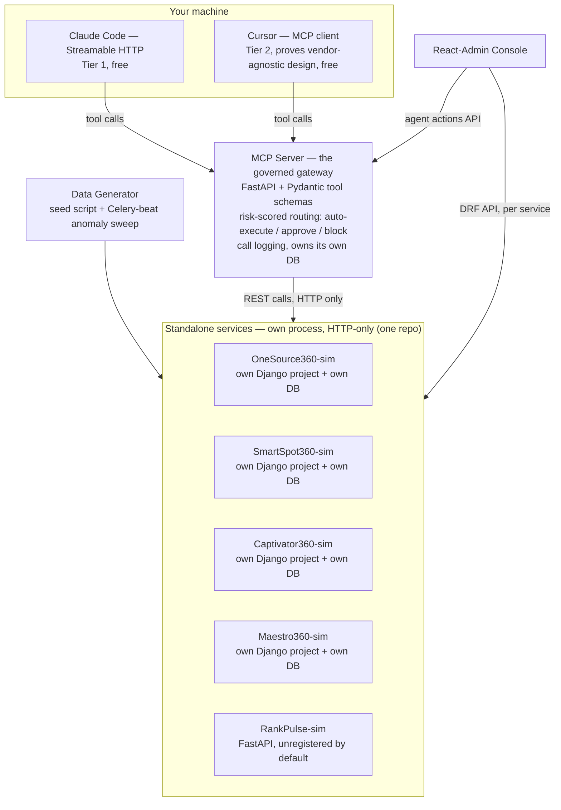

# Agent360 — Planning Doc

> An MCP-based governed gateway that lets an LLM agent safely investigate and act across independent marketing-technology systems, with autonomy calibrated to risk rather than gated behind a single blanket "ask a human every time" rule. Modeled on a real company's public technology stack as a grounded case study, rather than an invented scenario.

Status: **complete.** Feature scope is closed at the current build. Tier 1 (phases 1–6 + 13) and Tier 2 (anomaly sweep, RankPulse-sim onboarding demo, JWT + service-token auth, GraphQL join, Simulate Next Day, GitHub Actions, OpenAPI) are live. All ten learning docs are complete (`LEARNING.md`). `.cursor/mcp.json` points at the local MCP server; a one-time `cursor-agent login` is the only setup step for the headless Cursor proof (credentials stay with whoever runs the demo). Restarting `mcp_server` clears its audit/approval tables and re-runs the anomaly sweep so demos start with a clean Agent Actions list.

---

## 1. Purpose

Three goals:

1. A concrete demonstration of a specific, transferable engineering pattern: a **governed MCP gateway** that lets an LLM agent read from and act on multiple independently-owned backend systems safely, with autonomy calibrated to risk instead of a single blanket human-approval gate. This is a general problem, not a niche one — any organization with several internal systems that don't talk to each other, especially ones that grow by acquiring point solutions or letting different teams adopt their own tools, runs into some version of it.
2. A demonstration of the **integration and translation work that sits at the center of a solutions-engineering role**: wiring together existing, heterogeneous systems — some already touched by ad hoc AI tooling, some just a pile of unconnected APIs different teams happen to use — into one coherent, safe, agent-accessible layer. Then making that layer legible to the non-technical people who use it day to day, not just to other engineers. Both halves — integration and translation — are treated as first-class parts of this project, not just the code.
3. A **learning vehicle**: most of this stack (Django, DRF, Celery, MCP server development, React-Admin) was new territory at the start. The repo ships with a parallel set of learning docs written alongside the code, explaining what each piece does and why, so the process of building this is itself the training.

Rather than invent a generic scenario, this project is grounded in a real company's publicly documented technology: BMG360, a performance-marketing agency that runs four proprietary platforms — a data warehouse, a media-buying engine, a creative platform, and a call-routing system — each individually sophisticated, with no public evidence they talk to each other autonomously (§2). That's a common shape of problem, and building against a real, if simulated, version of it keeps the data model and constraints honest instead of convenient.

**A note on where the data models come from**: this project has no non-public knowledge of BMG360's actual systems, and is **not affiliated with BMG360**. The four simulated platforms are modeled from (a) BMG360's own public descriptions of what each platform does, (b) one piece of real technical detail — an AWS engineering blog post on SmartSpot360's actual architecture — and (c) standard, industry-wide patterns for how direct-response/martech systems represent this kind of data (campaigns with spend/CPL rollups, creative assets with CTR over time, call-center routing and outcome logs). None of that last category is BMG360-specific. This boundary — researched fact vs. plausible simulation — is stated explicitly in the repo's README, not glossed over.

---

## 2. Case Study Context: BMG360

**BMG360** — full-service direct-response performance marketing agency, Shelton CT, ~190–250 employees, PE-backed (Fort Point Capital), formerly Barrington Media Group. Runs campaigns across TV, CTV, radio, direct mail, paid search, paid social, SEO for verticals including Medicare Advantage, insurance, home services, D2C/eCommerce, health & wellness, education, B2B. Optimizes for "fixed-cost leads."

**Their four existing "360" platforms:**

| Platform | Function | Known tech (public sources) |
|---|---|---|
| **OneSource360™** | Proprietary data warehouse; unifies call flow, media spend, and performance data across channels | Data warehouse pattern, feeds media buying decisions |
| **SmartSpot360™** | ML-driven TV/radio media buying — predicts and allocates ~3,500 spots/week | **Confirmed via AWS blog**: SageMaker (model train/deploy), Glue (ETL), Snowflake (warehouse), Lambda (real-time decisions), API Gateway (tool access), SNS (event-driven coordination) |
| **Captivator360™** | Creative performance platform — personalized creative at scale, automation-driven | — |
| **Maestro360™** | Real-time call routing — matches inbound calls to best-fit client agent | — |

**Whitespace confirmed**: no public mention (blog, case studies, press, LinkedIn) of these four systems being connected by an autonomous/LLM agent layer — which is what makes this a real gap to build against rather than a solved problem restated.

**Why this matters**: modeling the simulated platforms on SmartSpot360's real, publicly-documented architecture means the resulting system reflects genuine constraints of this kind of infrastructure (event-driven pipelines, warehouse-backed rollups, API-gated tool access) instead of a toy example built to be convenient.

**The two-layer business problem this project answers:**
1. **Immediate**: when CPL spikes on a campaign, nothing in a siloed four-platform stack can explain why across systems — a human has to manually cross-reference dashboards, which doesn't scale as campaign count grows.
2. **Structural**: BMG360 grows partly by acquisition (Blackbird Garage, Five Mill, Thesis, the SEO Department) — every acquisition tends to bring its own disconnected tooling. An MCP tool registry is a structural answer: a newly acquired platform exposes one MCP-compatible surface, once, and any agent — Claude Code today, a different vendor's agent tomorrow — can use it without bespoke point-to-point integration work.

---

## 3. Project Concept

**Agent360**: an MCP server that exposes tools across four standalone, independently-deployed simulated platforms (OneSource360-sim, SmartSpot360-sim, Captivator360-sim, Maestro360-sim), used by **Claude Code (or Cursor) as the agent** to diagnose performance problems and act on them — with autonomy calibrated to risk, not gated behind a single blanket "ask a human every time" rule.

**Demo narrative**: a campaign has a deliberate, compound-cause CPL spike seeded into its data (concrete numbers in §9). React-Admin shows it flagged. You open Claude Code — already connected to the local MCP server — and ask it, in plain language, to investigate. It calls tools live across all four independent services. It rules out one cause (the media buy didn't change) and finds the real root cause spanning two systems that no single platform's own dashboard would show. It then proposes a set of actions, each scored for risk: a small, well-supported change **auto-executes** and is logged; the larger reallocation is **routed to the human approval queue** with its reasoning attached; a creative-refresh request that would leave the campaign with zero active creatives is **blocked outright**, with the agent told why. One session shows all three tiers of autonomy, not a single repetitive "please approve" loop.

**Live fifth-platform flourish**: RankPulse-sim is already built and running — a stand-in for a newly-acquired tool — but left unregistered until one import line is uncommented during the demo. That dramatizes how fast a new system joins the existing agent ecosystem, answering BMG360's structural acquisition-integration problem (§2).

---

## 4. Scope

This is a **standup demo and a learning project, not a production system**. Feature scope is **closed** at what's already in the repo.

It was built in two passes so the pitch (Tier 1) was demoable before the extras (Tier 2). Both passes are done.

**Zero-cost constraint**: no paid Anthropic API key required for the core demo, no paid hosting. The agent runs through Claude Code/Claude Desktop's existing MCP client support (already covered by your Claude subscription — no programmatic API billing). Everything else runs locally via Docker Compose.

### Tier 1 — Core (the pitch)
- Four **standalone** Django services (own project, own database each — not apps inside one shared backend), with real models, migrations, and DRF REST APIs
- Seed data generator with the deliberate compound-cause scenario baked in (§9)
- MCP server exposing read + write tools across all four services, with its own database for tool-call logging
- **Risk-scored guardrail layer** on write tools — not a binary approve/reject gate, but a computed risk score routing each action to auto-execute / human approval / hard block (§7), with a score-independent hard cap, configurable thresholds, and pre-action state snapshotting on auto-executed actions for audit. This is the project's core differentiator, and the most heavily tested code in the repo.
- Claude Code wired up and working live against the MCP server
- React-Admin: campaign views + an agent-actions view showing all three outcome states, with plain-language reasoning as the default view (§7, §10)
- Technical learning docs written alongside each piece as it's built, plus the plain-language guide for non-technical users once the demo works (§12)

### Tier 2 — Built extras
- Deterministic anomaly sweep (Celery beat) that auto-flags campaigns
- Fuller React-Admin: tool-call trace log, per-platform data explorers (Spots, Creatives, Call Routing), Overview dashboard
- One GraphQL endpoint joining data across all four platforms in a single query
- JWT issuance (`POST /api/token/`, demo user) + client-credentials-style service token (MCP server → each Django service)
- **Provider-agnostic proof**: the same MCP server registered in **Cursor** as a second MCP client
- **Live fifth-platform onboarding demo**: RankPulse-sim, built and running, left unregistered until a one-line import is uncommented
- Per-service webhook receivers and Overview "Simulate Next Day"
- GitHub Actions CI + OpenAPI (`/api/docs/`) per Django service

---

## 5. System Architecture



**Key design principle — the MCP server is a governed gateway, not just a tool proxy.** Every write action gets scored for risk and routed accordingly, *regardless of which client is driving it* — Claude Code today, Cursor as a second proof point, a different vendor's agent tomorrow. Governance lives at the tool layer, not the agent layer, which is the actual answer to "what happens when you switch models": nothing has to change. Tier 2's Cursor test exists specifically to prove that claim rather than just assert it.

**Why four standalone services, not four apps in one Django project**: the entire pitch is "these systems didn't talk to each other, and I built the thing that connects them." If all four lived in one process sharing one database, that claim wouldn't survive scrutiny — it would just be one app with internal modules. Four independent services (own database, HTTP-only communication, no shared ORM or imports across service boundaries) make the connectivity claim literally true. This does **not** require four separate git repositories — repo layout and runtime independence are orthogonal. One monorepo containing four independent, separately-containerized services is a normal pattern, and easier for a reviewer to clone and evaluate. It also means running `django-admin startproject` for real, multiple times — better practice for learning Django from scratch than hiding the pattern inside one project's folder structure.

**No custom agent-orchestration service.** Claude Code already has a production-grade tool-calling loop; rebuilding one would be wasted effort that also costs API money. This also means a live, step-by-step trace of the agent's tool calls comes for free — it's just how Claude Code's interface already works, not something built separately for effect.

| Component | Tech | Role |
|---|---|---|
| 4 sim platform services | Django + DRF, own Postgres DB each | Stand in for the 4 real BMG360 systems; fully independent, HTTP-only |
| RankPulse-sim | FastAPI, no DB | Fifth-platform onboarding demo; running but unregistered until one import is uncommented |
| MCP server | FastAPI + Pydantic + Python MCP SDK, own Postgres DB | Exposes tool registry; proxies to the sim services over REST; enforces guardrails; owns the audit/approval data. On boot, truncates those audit tables and re-runs the anomaly sweep so Agent Actions starts clean (same idea as the sims reseeding) |
| Agent | Claude Code (Tier 1) / Cursor (Tier 2 proof) | External, pre-built — connects via config, no custom orchestration code |
| Event pipeline (Tier 2) | Celery + Redis, hosted alongside the MCP server | Celery beat runs the deterministic anomaly sweep on a timer (reusing the MCP server's own detection code path — no LLM involved). Simulated "live" data drops are driven by Overview's Simulate Next Day (`POST /simulate-next-day`), which posts to each service's own webhook receiver |
| Frontend | React-Admin | Human console: view data across all 5 backends, view proposed actions, approve/reject |
| Data layer | Postgres (one server, 5 logical databases) | Each service and the MCP server own their own database; no shared tables |

---

## 6. The Four Simulated Platforms

Each is a **standalone Django project** (own `manage.py`, `settings.py`, `Dockerfile`, database) — not a module inside a shared backend. HTTP paths below are under `/api/`.

### OneSource360-sim — unified performance warehouse
- **Models**: `Campaign` (vertical and channel are `TextChoices`, not lookup tables; target_cpl, status, dates), `DailyPerformanceRollup` (campaign, date, spend, leads, calls, conversions, cpl, roas)
- **Endpoints**: `GET /campaigns/`, `GET /campaigns/{id}/`, `GET /performance/?campaign_id&start&end`, `POST /webhooks/daily-performance/`
- **MCP tools**: `list_campaigns(vertical?, channel?, status?)`, `get_campaign_performance(campaign_id, start_date?, end_date?)`, `get_performance_anomalies(threshold_pct?, window_days?)`

### SmartSpot360-sim — TV/radio buying optimization
- **Models**: `Station` (name, market, medium), `Daypart` (name, cost multiplier), `Spot` (campaign_id, station, daypart, air_date, cost, creative_label), `SpotPerformance` (calls, conversions, cpl), `BudgetRecommendation` (allocation JSON, rationale, confidence, applied)
- **Recommendation logic**: deterministic weighted scoring over historical `SpotPerformance` (favor dayparts/stations with lower historical CPL for that vertical). The scoring function also outputs a simple confidence measure (how much historical data backs the given daypart/station combo), which feeds directly into the MCP server's risk-scoring guardrail (§7).
- **Endpoints**: `GET /spots/?campaign_id`, `GET /spots/{id}/performance/`, `POST /recommendations/` (campaign_id, budget → ranked allocation), `POST /recommendations/{id}/apply/`, `POST /webhooks/spot-performance/`
- **MCP tools**: `get_spot_performance(campaign_id)`, `get_budget_recommendation(campaign_id, budget_amount)`, `reallocate_budget(campaign_id, recommendation_id)` *(write — guardrailed)*

### Captivator360-sim — creative performance
- **Models**: `CreativeAsset` (campaign_id, variant_label, channel, is_active), `CreativePerformanceDaily` (impressions, ctr, conversion_rate), `CreativeRefreshRequest` (status, requested_at)
- **Endpoints**: `GET /creatives/?campaign_id`, `GET /creatives/{id}/performance/`, `GET /creatives/declining/`, `POST /creatives/{id}/refresh-request/`, `POST /creatives/refresh-requests/{id}/resolve/`, `POST /webhooks/creative-metrics/`
- **MCP tools**: `get_creative_performance(campaign_id)`, `get_declining_creatives(campaign_id, decline_threshold_pct)`, `request_creative_refresh(creative_id, reason)` *(write — guardrailed)*

### Maestro360-sim — call routing
- **Models**: `ClientAgentPool` (vertical_specialty, historical_conversion_rate, is_certified_medicare — the compliance detail from §9), `RoutingRule` (priority order), `CallEvent` (campaign_id, timestamp, routed_pool, wait_time_seconds, duration, outcome)
- **Endpoints**: `GET /calls/?campaign_id&start&end`, `GET /calls/summary/?campaign_id`, `GET /routing-rules/`, `POST /webhooks/call-events/`
- **MCP tools**: `get_call_quality(campaign_id, start_date?, end_date?)`, `get_routing_summary(campaign_id)`

---

## 7. MCP Server & Tool Registry (the governed gateway)

- Built with **FastAPI + Pydantic** using the official Python MCP SDK.
- Owns its **own Postgres database** — `AgentToolCall`, `ProposedAction`, `ExecutedAction`, `FlaggedCampaign` — separate from all four sim services. The four services know nothing about agents, approvals, or logging; they just serve their own REST APIs.
- Organized as a **config-driven tool registry**: each entry maps `tool name → handler → backing service's REST API → Pydantic input/output schema` — standard practice for an MCP server meant to be trustworthy at scale, where tool schemas need to be validated, not just documented. The registry doubles as documentation: a `/tools` introspection endpoint exposes every tool's schema, which is what makes the registry genuinely self-documenting rather than relying on the pedagogical docs in §12 to double as a reference.
- **Read tools** (`get_*`, `list_*`) execute immediately against the relevant service's REST API and are logged to `AgentToolCall`.
- **Write tools** (`reallocate_budget`, `request_creative_refresh`) never execute unconditionally. Each proposed action is run through a **deterministic risk-scoring function** — this is the project's headline differentiator, replacing a naive "every write action needs a human" gate with something closer to how autonomy actually gets deployed responsibly.

  **Risk score (0–100)**, computed from four inputs — defined **per tool**, since "budget dollars" doesn't mean anything for a creative refresh request:
  - **Magnitude** — size of the change relative to baseline. For `reallocate_budget`: % of campaign budget moved. For `request_creative_refresh`: how disruptive the request is — e.g., whether this is the campaign's only active creative (leaves a gap) vs. one of several.
  - **Confidence** — how much data backs the request. For `reallocate_budget`: sample size behind SmartSpot360-sim's scoring function (§6). For `request_creative_refresh`: number of days of `CreativePerformanceDaily` backing the CTR reading.
  - **Recency** — whether this campaign was already modified in the last 24 hours (repeat changes raise risk) — same definition for every tool.
  - **Regulatory sensitivity** — a multiplier for regulated verticals (Medicare Advantage gets stricter thresholds, tying into the Pool B certification detail in §9) — same definition for every tool.

  **Routing** — the thresholds below are **configurable policy values, not constants baked into the agent**. That distinction matters for how this reads to a risk-conscious technical audience: the business sets the dial, the deterministic layer enforces it, the agent doesn't get to decide its own leash.
  - **Below the auto-execute threshold (default 30) → auto-execute** — *and only if the action also clears a fixed, score-independent hard cap* (e.g., never auto-execute a reallocation above 5% of a campaign's baseline weekly spend, full stop, regardless of what the score says). This is defense in depth against a bug in the scoring function itself — a single miscalculation shouldn't be able to let a large action through unsupervised. Fires immediately, logged as `ExecutedAction` **with the pre-action state snapshotted alongside it** for audit (visible in Agent Actions / the technical trace). Surfaced in React-Admin's Agent Actions list as already-done, not something waiting on anyone.
  - **From the auto-execute threshold up to (but not including) the block threshold (default 30 up to 70) → human approval.** A `ProposedAction` record is created with status `pending_approval`; the tool returns that status to the agent, not a completed result. A human approves/rejects in React-Admin; approval triggers the real write call.
  - **At or above the block threshold (default 70) → hard block.** The tool returns a rejection with the reason to the agent instead of creating any pending record; the agent can propose a smaller or different action instead.

  All three outcomes are logged identically to `AgentToolCall` regardless of tier — the difference is only in whether execution is immediate, queued, or refused.
- **The reasoning attached to every action is written for the person approving it, not for another engineer.** The agent is instructed to explain *why* in plain business language — "the ad creative has gone stale and calls are being routed to a lower-performing team" rather than "ctr_decline_pct=38, pool_b_pct=0.35." The full technical trace is still logged and available on request; it's just not the default thing a human sees. This is the translation work described in §1, treated as a real design requirement rather than an afterthought.
- **Tests**: the risk-scoring function is the safety-critical part of the whole system and gets the heaviest coverage in the repo — every threshold boundary, the hard cap, and each tool's per-input definitions get explicit test cases.
- Auth (Tier 2): MCP server holds a service-level client-credentials token to call each of the four services' APIs, distinct from user-facing JWT login on React-Admin.

---

## 8. The Agent: Claude Code (Tier 1) / Cursor (Tier 2 Proof)

No custom orchestration code for Tier 1. Setup is configuration, not implementation:

1. Run the MCP server via Docker Compose, exposed over **Streamable HTTP** (not stdio — the server is a long-lived containerized service reachable by multiple clients, which stdio's spawn-the-process model doesn't fit).
2. Register it with `claude mcp add --transport http agent360 http://localhost:8100/mcp`.
3. Converse naturally — Claude Code's own agent loop handles tool selection, multi-step reasoning, and retries. Every tool call flows through the MCP server, which logs it to `AgentToolCall` and routes it through the risk-scoring guardrail (§7).

**Tier 2 — provider-agnostic proof**: the same MCP server is registered in **Cursor's** MCP config (`.cursor/mcp.json`) so the investigation can be re-run there. Cursor is a genuinely independent client implementation (built by Anysphere, not Anthropic) — a cleaner proof of "same server, different client" than routing through another Anthropic surface, and it needed no new gateway code.

**Tier 2 — live fifth-platform onboarding demo**: RankPulse-sim is built and running, with its MCP tool left *unregistered* until one import line is uncommented in the demo — a thin adapter plus a registry entry, no changes to the MCP server's core code. That shows how a newly-acquired platform joins the existing agent ecosystem (§2's structural business problem), rather than just asserting it.

**Tier 2 — proactive flagging without an LLM in the loop**: a Celery beat schedule, hosted **alongside the MCP server itself** — not a separate, unowned service — periodically calls the exact same function an agent would use (`get_performance_anomalies` across active campaigns) and writes a `FlaggedCampaign` record to its own database when a rollup crosses the CPL threshold. Pure SQL/math, zero LLM cost. The MCP server is the only component with a clean, already-built reason to read across all four services this way, so this is where the task belongs rather than living inside one of the sim services or as a floating fifth component. **Scheduled monitoring and agent-driven investigation are the same code path** — a timer instead of a conversation. This is what shows up in React-Admin as "needs investigation," which is what you point Claude Code at during the demo.

---

## 9. Data Strategy

### The concrete demo scenario

**Campaign**: "Medicare Advantage – Southeast TV," target CPL $45.

| Week | OneSource360-sim | SmartSpot360-sim | Captivator360-sim | Maestro360-sim |
|---|---|---|---|---|
| 1–3 (baseline) | ~$50k spend/wk, ~1,100 leads/wk, **CPL ~$45** | Same daypart/station mix all 3 weeks | Creative CR-114 running, CTR ~2.0% | Pool A (31% conversion, Medicare-certified) handles ~90% of calls, Pool B (18% conversion, **not** Medicare-certified) ~10% |
| 4 (flagged) | Same $50k spend, only ~735 leads, **CPL ~$67** (+49%) | No change — spend mix identical to prior weeks | CR-114 now 5 weeks old, last-week CTR ~25% below its own first-week baseline | Pool A hit capacity; Pool B took ~35% of call volume instead of 10% |

**What gets flagged**: OneSource360-sim's rollup CPL crosses the campaign's target by >15% — a plain SQL threshold check, nothing clever.

**What investigating it reveals**: checking SmartSpot360-sim first rules out a media-buy change (useful negative evidence — nothing moved there). Captivator360-sim shows the creative going stale. Maestro360-sim shows call volume quietly shifting into a lower-converting, non-certified pool in the same week. Neither fact alone explains a 49% CPL jump; together they compound — and the answer only exists at the intersection of two systems, which is the actual point of the project. The non-certification detail (pulled from BMG360's own public emphasis on "compliance-first" Medicare Advantage call handling) adds a real regulatory angle at near-zero extra modeling cost.

### Seed data generation

`seed_data` management command: **28 days** of daily history across **6 campaigns** spanning 3 verticals, with the pattern above baked into campaign 1 specifically, plus generally realistic (not random) correlations across the others — certain daypart/station combos outperforming for certain verticals, creative CTR declining predictably.

**Tier 2 — live event simulation**: Overview's "Advance one day" posts a new day of warehouse rollups, spot performance, call events, and creative metrics as webhook payloads to **each service's own receiver** — OneSource360-sim, SmartSpot360-sim, Captivator360-sim, and Maestro360-sim each expose one for their own data, matching the "each service owns its data" principle rather than routing through one shared endpoint — exercising the async ingestion path live instead of just showing static seeded data.

---

## 10. React-Admin Frontend

React-Admin's data provider is **resource-routed across five backends** — the four sim services (each serving its own resources) plus the MCP server's own API (for the approval queue and tool-call log).

**Resources:**
- Campaigns — read-only view of OneSource360-sim data
- Agent Actions — every action the agent has taken or proposed (from the MCP server's DB), with a status badge per risk tier: **Executed** (auto), **Pending Approval** (needs a human), **Blocked** (hard limit hit) — with the agent's plain-language reasoning (§7) and computed risk score attached to each. The Show page adds a **technical trace**: which MCP tool ran, the REST calls it mapped to (MCP-network URL and the localhost URL you can hit in a browser), logged arguments/result, handler source, and for writes the scoring/policy functions that produced the decision.
- Tool-call trace log (what the agent checked, in order) — same technical trace on the Show page, including reads
- **Systems** — one page per simulated application (OneSource360, SmartSpot360, Captivator360, Maestro360, RankPulse, and the Agent360 gateway). Each page shows what the system is for, what the seeded data is supposed to look like, a live snapshot of that service's Postgres tables (`GET /api/inspect/` on the Django services; `GET /inspect` on the gateway), every REST endpoint, and every MCP tool with the Python that implements it. This is the demo view for "the agent extracted this from that table via that HTTP call."
- Platform operational explorers — Spots, Creatives, Call Routing (still routed; opened from the matching Systems page)
- Flagged campaigns (from the anomaly sweep), surfaced on Overview

**Auth**: JWT via DRF (`djangorestframework-simplejwt`) on each Django service (`POST /api/token/`, demo user `demo`/`demo`); `X-Service-Token` for MCP → Django. The local React-Admin console does **not** log in — GET stays `AllowAny` so healthchecks and the console work without a login wall; writes and webhooks on the Django services require one of those two credentials (`docs/learning/07-auth-jwt-oauth2.md`). Approve/reject/sweep/simulate on the MCP server are likewise unauthenticated local-demo REST.

**Implementation notes**: React-Admin ships `combineDataProviders` for routing by resource name to different backends. This repo **does not use it** — `frontend/src/dataProvider.js` hand-rolls `getList`/`getOne` and paginates client-side, because the five backends don't share a pagination/sort convention and the demo data volume is small. CORS is configured on every service (`django-cors-headers` on the four Django services, FastAPI's CORS middleware on the MCP server).

---

## 11. Concepts & Skills Demonstrated

| Area | Where it's demonstrated |
|---|---|
| RESTful & GraphQL API design across multiple services | DRF REST across 4 independent services (Tier 1); one GraphQL join query (Tier 2) |
| MCP server design for LLM tool/data access | Core of the project — §7 |
| Webhook receivers, event-driven triggers | Tier 2 live event simulation — §9 |
| Tool registries, schema validation | Tool registry design, Pydantic schemas, guardrails — §7 |
| Django backend design, Postgres-backed workflow state | 4 standalone services + MCP server's own AgentToolCall/ProposedAction/FlaggedCampaign DB |
| DRF endpoints for a React frontend | §10 |
| Celery async processing | Tier 2: anomaly sweep on a beat schedule; Simulate Next Day via `POST /simulate-next-day` |
| LLM agent integration | Claude Code as the agent (zero cost); Cursor as a second, independent client (proves the design isn't tied to one vendor) |
| React-Admin dashboards | §10 |
| API documentation practices | Auto-generated OpenAPI docs per service (drf-spectacular) + the MCP server's own `/tools` introspection endpoint (§7) — distinct from the pedagogical learning docs in §12, which teach rather than reference |
| FastAPI, Pydantic, pytest | MCP server stack + test suite, with the heaviest coverage on the risk-scoring function specifically (§7) |
| JWT, service-token, webhook security | Tier 2 — JWT for users, client-credentials-style token for MCP server → each service |
| PostgreSQL schema design | 5 independent database schemas (4 services + MCP server) |
| Docker, CI/CD | Docker Compose orchestrating all services locally (Tier 1); GitHub Actions running MCP pytest + the frontend production build (Tier 2) |
| Performance-warehouse modeling | OneSource360-sim campaign + daily rollup schema and seed scenario (§6, §9) |

---

## 12. Learning System & Stakeholder Documentation

Two separate documentation tracks, for two different audiences — writing one and calling it "docs" would serve neither well.

### 12.1 Technical learning docs — for the builder

Since most of this stack is new, the repo carries a **parallel set of learning docs**, written *while* each piece is built — not bolted on afterward once the details are fuzzy. Purpose: being able to explain any file in this repo, not just point at it working.

**Structure:**
- `LEARNING.md` at repo root — index/table of contents, one line per topic doc, plus a short "how to use this" note
- `docs/learning/` — one doc per topic, numbered in build order:
  1. `01-django-basics.md` — models, the ORM, migrations, settings, what a Django project/app is, and why this repo runs four of them independently instead of one
  2. `02-drf-rest-apis.md` — serializers, viewsets, routers; how DRF sits on top of Django
  3. `03-postgres-schema-design.md` — how each service's schema was designed, FK relationships and why, and why each service owns its own database
  4. `04-celery-and-async.md` — brokers, workers, beat scheduler, why async matters here specifically
  5. `05-mcp-servers.md` — what MCP actually is, why it exists, how tool schemas, the registry, and the risk-scored autonomy design (§7) work; this is the most important doc in the set, since integration design is the actual center of gravity of this project (§1)
  6. `06-claude-code-as-agent.md` — how Claude Code connects to a local MCP server, what happens under the hood on a tool call, and how the Tier 2 Cursor connection proves the same server works with a genuinely independent client
  7. `07-auth-jwt-oauth2.md` — JWT vs. OAuth2 client-credentials, why each is used where it is
  8. `08-react-admin.md` — resources, data providers routed across multiple backends, how it talks to DRF
  9. `09-docker-compose.md` — how independent services are networked together in one Compose file despite being separate processes/databases
  10. `10-architecture-recap.md` — the governed-gateway principle end to end; the talking points for presenting this project

**Per-doc template**: What it is (plain English) → Why this piece of the stack is used here → Where it lives in this repo (real file paths) → Key vocabulary → optional "try this yourself."

**Workflow**: each build phase in §14 ends with writing or updating the matching learning doc before moving on, while the code is fresh.

### 12.2 A guide for non-technical users

`docs/for-marketers.md` — written for the actual people this system is built for: a marketing ops analyst or account manager who'd use the approval queue, not an engineer. This is **not** a simplified version of the technical docs; it's a different document with a different job, and it's as much a part of the deliverable as the code, given §1's second goal.

**Structure:**
- What this is and why it exists, in plain language for day-to-day users
- What the three outcomes (auto-executed / needs your approval / blocked) actually mean for someone using it day to day
- A walkthrough of the demo scenario (§9) told as a business story — a campaign's cost-per-lead went up, here's what turned out to be going on, here's what happened next — not as a data table
- A short FAQ anticipating the real questions a cautious stakeholder asks: can it spend money without me knowing? What happens if it's wrong? Can this be turned off or made stricter?
- A one-line-per-term glossary (MCP, agent, guardrail, risk score) for anyone curious enough to peek at the technical side

Written against the working demo (§14), so it describes the real seeded scenario and outcomes.

---

## 13. Repo Structure

One repository. Runtime independence (separate processes, separate databases, HTTP-only communication) is what proves the connectivity story — not separate git repos, which would only add overhead for a solo project.

```
agent360/
├── docker-compose.yml         # one Postgres server, 5 logical databases; 11 containers
├── PLANNING.md
├── LEARNING.md
├── docs/
│   ├── learning/                # topic-by-topic technical learning docs, see §12.1
│   ├── for-marketers.md          # plain-language guide for non-technical users, see §12.2
│   ├── field-notes.md            # live walkthrough for a CTO / stakeholder demo, illustrated with a real run
│   └── assets/field-notes/       # screenshots embedded in field-notes.md
├── services/
│   ├── onesource360/            # standalone Django project, own DB
│   ├── smartspot360/            # standalone Django project, own DB
│   ├── captivator360/           # standalone Django project, own DB
│   ├── maestro360/              # standalone Django project, own DB
│   └── rankpulse_sim/           # FastAPI fifth-platform demo, unregistered by default
├── mcp_server/                   # FastAPI + MCP SDK — tool registry, risk-scored guardrails,
│                                  # owns its own DB (AgentToolCall, ProposedAction, ExecutedAction, FlaggedCampaign)
│                                  # also hosts the Celery beat anomaly sweep (§8)
├── frontend/                     # React-Admin — data provider routed across the 4 Django services + MCP
├── .cursor/mcp.json              # Cursor MCP client config → localhost:8100/mcp
└── .github/workflows/             # CI: mcp pytest + frontend production build
```

---

## 14. Build Phases

Each phase ended with the matching learning doc. This is a historical record of how the repo was built, not a backlog.

**Sequencing principle**: prove the genuinely novel, risky part — the MCP server talking to Claude Code — with the smallest possible slice, before sinking time into building out all four services. Validating the unfamiliar integration first means problems surface early, not after the easy, repetitive work is already done.

1. **Walking skeleton** *(Tier 1)* — Docker Compose scaffolding; build **just** OneSource360-sim's `Campaign` + `DailyPerformanceRollup` models and API; build the MCP server with **exactly one tool** (`get_campaign_performance`) wired to it; connect Claude Code and confirm a real tool call round-trips end to end. Nothing else gets built until this works. → `01-django-basics.md`, `05-mcp-servers.md` started
2. **Fill out all four services** *(Tier 1)* — flesh out OneSource360-sim fully, then build SmartSpot360-sim, Captivator360-sim, Maestro360-sim following the now-proven pattern; seed command with the compound-cause scenario; auto-generated OpenAPI docs per service → `02-drf-rest-apis.md`, `03-postgres-schema-design.md`
3. **Full MCP tool registry + risk-scored guardrails** *(Tier 1)* — remaining read/write tools across all 4 services; the risk-scoring function defined per-tool, with the hard cap, configurable thresholds, and pre-action state snapshotting for audit; the `/tools` introspection endpoint; heavy test coverage on the scoring function specifically → `05-mcp-servers.md` completed
4. **Claude Code integration, full scenario** *(Tier 1)* — run the actual seeded investigation live, confirm all three risk tiers fire correctly end to end → `06-claude-code-as-agent.md`
5. **Frontend (bare-bones)** *(Tier 1)* — React-Admin: campaigns + Agent Actions view (executed/pending/blocked), hand-rolled `dataProvider` across all five backends, CORS configured on every service → `08-react-admin.md`
6. **Business-user guide + wrap-up dry run** *(Tier 1)* — write `docs/for-marketers.md` (§12.2) against the real, working demo; full rehearsal end to end before moving to Tier 2, so there's always a working, demoable state banked
7. **Async layer** *(Tier 2)* — Redis + Celery hosted alongside the MCP server; anomaly sweep reuses the MCP server's own tool-call code path; per-service webhook receivers for live event simulation → `04-celery-and-async.md`
8. **Auth hardening** *(Tier 2)* — JWT + client-credentials token → `07-auth-jwt-oauth2.md`
9. **Provider-agnostic proof** *(Tier 2)* — register the MCP server in Cursor, re-run the investigation there
10. **Live fifth-platform onboarding demo** *(Tier 2)* — RankPulse-sim built and running, left unregistered until the live demo moment
11. **Frontend polish** *(Tier 2)* — tool-call trace log, platform data explorers, flagged campaigns view
12. **GraphQL + CI + Docker recap** *(Tier 2)* — one join query, GitHub Actions, `09-docker-compose.md`
13. **Final wrap-up** — `10-architecture-recap.md`, README with demo script

---

## 15. Decisions Log

| Decision | Resolution | Why |
|---|---|---|
| Project name | **Agent360** | — |
| Creative platform spelling | **Captivator360** | Confirmed from BMG360's own site |
| Cost | **$0** local stack; agent runs through an existing Claude / Cursor subscription | Explicit zero paid-API-key constraint for the demo |
| Agent runtime | **Claude Code** (Tier 1), **Cursor** (Tier 2 proof) — not a custom hand-written orchestration loop, not the Anthropic API | Zero orchestration code to build/maintain, more convincing live demo; Cursor is a genuinely independent vendor implementation, which is a cleaner vendor-agnostic proof than routing through another Anthropic surface |
| Service architecture | **Four standalone Django services, one monorepo** — not apps inside one shared backend, not four separate repos | Only real separation (own process, own DB, HTTP-only) makes the "connected disconnected systems" claim survive scrutiny; repo layout is a separate, non-architectural concern |
| Data model sourcing | Public research + industry-standard martech patterns + scenario-driven design; explicitly not internal BMG360 knowledge | Stated transparently in-repo rather than implied |
| Demo scenario | Compound-cause CPL spike (creative CTR decline + call routing shift to a lower-converting, non-certified pool) on one seeded campaign | Only explainable by combining 2 systems; cheap compliance detail pulled from BMG360's own public material |
| Approval model | **Risk-scored, three-tier autonomy** (auto-execute / human approval / hard block) — not a single binary approve/reject gate | Promoted to Tier 1 as the project's core differentiator; answers the real question about deploying autonomous agents responsibly, not just "can it call tools" |
| Live demo flourish | RankPulse-sim built and running, left unregistered until one import is uncommented | Dramatizes the acquisition-integration structural business problem concretely instead of just asserting it |
| Auto-execute safety | Added a fixed, score-independent hard cap and pre-action state snapshotting for audit; made risk thresholds configurable policy rather than hardcoded constants | Defense in depth against a scoring-function bug; reframes the optics from "the AI trusts itself" to "the business sets policy, the system enforces it" — matters for how this lands with a risk-conscious audience |
| Risk-scoring inputs | Defined magnitude/confidence per tool rather than reusing `reallocate_budget`'s dollar-based definition for `request_creative_refresh` too | The original single definition didn't apply to the second write tool and would have blocked implementing it |
| Celery/Redis ownership | Hosted alongside the MCP server, not a separate or unowned component; the anomaly sweep reuses the MCP server's own tool-calling code path | Only the MCP server has a clean, already-built reason to read across all four services; this also unifies scheduled monitoring and on-demand investigation into one code path instead of two |
| Webhook receivers | Each of the four sim services owns its own receiver, not one shared central endpoint | Matches the "each service owns its own data" principle that makes the rest of the architecture honest |
| Build sequencing | Build a one-service, one-tool walking skeleton (OneSource360-sim + MCP server + Claude Code, end to end) before building out all four services | De-risks the genuinely novel part — the MCP/Claude Code integration — early, instead of discovering problems with it only after a long slog through repetitive service scaffolding |
| API documentation | Added auto-generated OpenAPI docs per service plus the MCP server's `/tools` introspection endpoint | The pedagogical learning docs teach the system; this is the actual machine-readable reference — a distinction worth having, and cheap to add |
| Testing | Explicit per-phase tests, with the heaviest coverage on the risk-scoring function specifically | The risk-scoring function is the safety-critical part of the system and deserves the most scrutiny |
| Auth depth | JWT (users) + client-credentials-style service token (MCP → each Django service) | Real patterns, proportionate effort for a local demo |
| GraphQL | One join query across all 4 platforms, not a parallel full API | Shows judgment about when GraphQL earns its place |
| Local-only | Docker Compose on a laptop | Matches the zero paid-hosting constraint |
| SmartSpot360 scoring | Deterministic weighted scoring over historical spot CPL | Sample-size confidence is what the guardrail needs |
| Scope | Closed at the current build | Stops feature creep once the pitch is demoable |
| Learning docs | Written per-phase alongside the code, not after | Keeps the docs accurate to what was actually built, and reinforces the material while it's still fresh |
| Stakeholder documentation | Added `docs/for-marketers.md` as a separate track from the technical learning docs, not a simplified version of them | Translating a technical system for non-technical users is a distinct, real skill this project treats as first-class (§1), not a footnote |
| UI for live table snapshots | Each Django service exposes `GET /api/inspect/`; the MCP server exposes `GET /catalog` + `GET /inspect`; Systems pages join them so a demo can point at the exact table, endpoint, and handler | The console is the only surface being demoed; the agent path has to be visible there, not only in logs |
| Repo naming | Product name is **Agent360**; the GitHub remote is **agentic-demo** | The two are independent — the local folder name doesn't need to match |
| Git workflow | Explicit review before commit/push | Full control over what reaches a public repo and when |
| Build workflow | Tier 1 built with minimal check-ins, followed by a full walkthrough once it's working | Prioritizes momentum through the core build; the learning happens in the walkthrough and the docs, not step-by-step narration |
