# Agent360 — Demo Walkthrough & Field Notes

A step-by-step guide to running the live demo, illustrated end-to-end with screenshots and real numbers from an actual run — not a script of what should happen, but a record of what did. Follow it start to finish even the first time through.

**Who this is for:** whoever is driving the demo — pointing at the screen, typing into Claude Code, talking through what's happening.
**How long it takes:** about 20 minutes for Steps 1–5. "Going further" below adds 10–15 minutes if your audience wants more.

**This run:** 11 containers healthy · 18 real MCP tool calls logged (15 reads, 3 writes) · all three risk tiers reached · a fifth platform onboarded live · one transport hiccup hit and explained, honestly, rather than edited out.

---

## Contents

- [What you're about to show](#what-youre-about-to-show)
- [Before you start](#before-you-start)
- [Step 1 — See what's already been caught](#step-1--see-whats-already-been-caught)
- [Step 2 — Confirm the problem is real](#step-2--confirm-the-problem-is-real-not-staged)
- [Step 3 — Ask Claude to investigate](#step-3--ask-claude-to-investigate)
- [Step 4 — Ask it to act](#step-4--ask-it-to-act-and-watch-three-different-outcomes-happen)
- [Step 5 — Check the full paper trail](#step-5--check-the-full-paper-trail)
- [Wrap-up: what to leave the room with](#wrap-up-what-to-leave-the-room-with)
- [Going further](#going-further)
- [FAQ](#frequently-asked-questions)
- [Something didn't go as expected](#something-didnt-go-as-expected)
- [Cheat sheet](#cheat-sheet)
- [Screens at a glance](#screens-at-a-glance)

---

## What you're about to show

Agent360 watches campaign performance across four systems that don't talk to each other — a spend tracker, a media-buying system, an ad-creative system, and a call-routing system. When a campaign's cost per lead goes bad, Agent360 can check all four in turn to find out why, propose a fix, and act on it — automatically if the fix is small and well-supported, or by asking a person first if it isn't. Anything too risky, it refuses outright. Every step is logged, in plain language, whether a human ever looks or not.

This walkthrough runs that whole loop live, on a real seeded scenario: a Medicare Advantage TV campaign called "Southeast TV" whose cost per lead has spiked about 50% above target, for reasons that only become clear once you look at two of the four systems together.

**The one sentence to keep coming back to, if a question ever knocks you off track:**

> The model doesn't decide how much authority it has — a scoring function outside the model does, and the *server* enforces it.

---

## Before you start

You need three things ready: the app running, its history wiped clean, and Claude Code connected to it.

**1. Is everything running?**
```bash
docker compose up -d
docker compose ps
```
Give it a minute on first boot. You're looking for `(healthy)` next to `onesource360`, `smartspot360`, `captivator360`, `maestro360`, `mcp_server`, `redis`, and `postgres`. (`frontend`, `rankpulse`, and the two `celery_*` services don't gate the walkthrough — "Up" is enough for those.)

If you've changed any MCP server code since it was last built, a plain restart won't pick it up — rebuild instead:
```bash
docker compose up -d --build mcp_server
```

**2. Start from a clean slate.** Restarting the gateway wipes its history and re-detects the one seeded problem, so the screens you're about to show start empty instead of full of old test data.
```bash
docker compose restart mcp_server
```
Give it a few seconds, then open the app and confirm: one campaign flagged, and both **Agent Actions** and **Tool Calls** empty.

**3. Connect Claude Code.**
```bash
claude mcp add --transport http agent360 http://localhost:8100/mcp
```
("already exists" is fine — it means this is already done.) Then start a **brand-new** Claude Code session rather than reusing an old one, so it isn't carrying stale results from earlier testing around in its context.

> **A real gotcha worth knowing about.** Claude Code's MCP client fetches the tool list once per session and doesn't refresh it if the server registers more tools later — for example, right after `docker compose restart mcp_server`, or after onboarding a new platform (see "Onboard a fifth platform live" under [Going further](#going-further) below). If a Claude Code session looks like it can only see one or two Agent360 tools when there should be eleven, this caching is almost always why — start a fresh session rather than debugging the server.

**Now open two windows side by side:**
- Your browser, at `http://localhost:3000/#/` — note the `#`. This app uses hash routing, so a bookmark or typed URL without it silently lands you on the dashboard instead of wherever you meant to go.
- Your Claude Code terminal.

**One thing worth knowing before you start typing:** Claude Code has its own safety layer, separate from Agent360's, that sometimes pauses to ask you to approve a tool call before Agent360 ever sees it. If you ask it to do something and nothing seems to happen, that's usually just an unapproved permission prompt sitting there — approve it and continue.

---

## Step 1 — See what's already been caught

Nothing to type yet. Just open `http://localhost:3000/#/`.

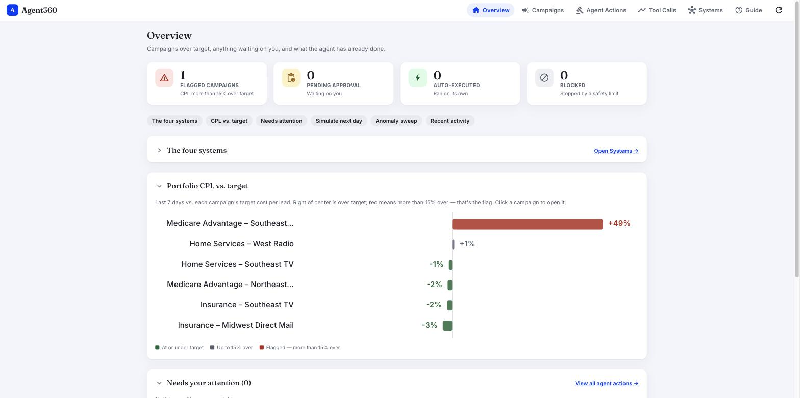

**What you'll see:** four stat tiles — flagged campaigns, pending approval, auto-executed, blocked — and, right now, only the first one is non-zero. "Medicare Advantage – Southeast TV" is flagged at roughly **+49% over its target cost per lead**. Everything else reads zero, because nothing has investigated or acted yet.

**Why this matters:** nothing on this screen needed an LLM. A scheduled job checks every active campaign's cost-per-lead against its target on a timer, whether or not anyone's watching, and writes down what it finds. Monitoring is free and always-on — the model only gets involved for the expensive part that comes next: figuring out *why*.

---

## Step 2 — Confirm the problem is real, not staged

**What to do:**
1. Click **Campaigns**, then open the flagged one.
2. Click **Systems → OneSource360**, then expand **MCP tools**.

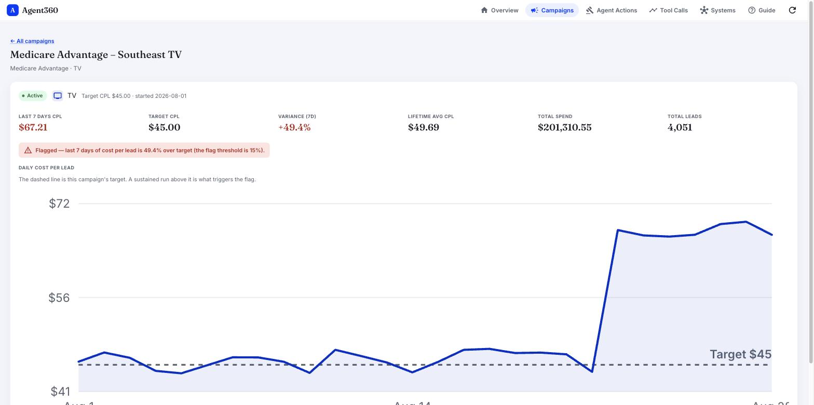

*Target CPL $45.00, last-7-day CPL $67.21, lifetime average $49.69 (only +10.4%). The spike is a real week-4 event that a lifetime average would quietly dilute away — this project's flagging logic deliberately uses the trailing 7-day window instead, for exactly this reason.*

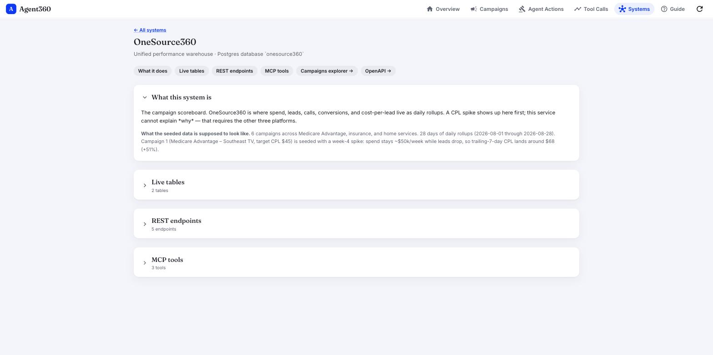

*`localhost:3000/#/systems/onesource360` — the seed data's own documentation of what it's supposed to contain, next to the live tables backing it.*

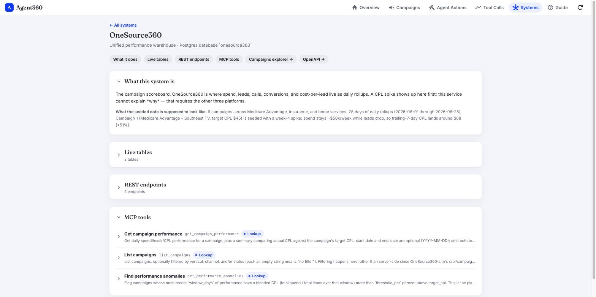

*Every tool the agent is about to call, mapped to the exact REST endpoint and Python handler it executes — readable before a single call happens.*

**Why this matters:** this is the same chart any ordinary BI dashboard would show you. What it *can't* show you is why — that answer doesn't live in this system at all. Every tool call in the next step hits one of the endpoints shown above, so there's nothing hidden between "the agent said this" and "here's the actual code and data behind it."

---

## Step 3 — Ask Claude to investigate

Switch to your Claude Code terminal and paste this, exactly:

> Investigate campaign 1 — Medicare Advantage Southeast TV. Cost per lead spiked. What happened, and what should we do? Read across the connected systems first — don't submit write actions yet. Summarize causes and what you'd recommend.

What ran, in order, against the real MCP server on this run:

| # | Tool call | System | What it found |
|---|---|---|---|
| 1 | `list_campaigns()` | OneSource360 | Campaign 1 identified · medicare_advantage · TV · target $45.00 |
| 2 | `get_performance_anomalies()` | OneSource360 | Flagged: trailing-7-day CPL $67.21 vs $45.00 → **+49.4%** (15% threshold) |
| 3 | `get_campaign_performance(1)` | OneSource360 | Stable $44–47/day through 8/21; step-change to $66–69/day from 8/22; leads 150–165/day → 104–109/day; **spend flat** the whole time |
| 4 | `get_spot_performance(1)` | SmartSpot360 | 56 spots, even 28/28 station·daypart split, avg CPL steady at $33–51 — **rules out** a media-buy change |
| 5 | `get_creative_performance(1)` | Captivator360 | CR-114: baseline CTR 2.03% → recent 1.52% → latest 1.24% |
| 6 | `get_declining_creatives(1)` | Captivator360 | Confirms CR-114 as the only declining creative — **25.1% decline**, past the 20% threshold |
| 7 | `get_routing_summary(1)` | Maestro360 | Lifetime: Pool A (certified) 83.9% share / 30.9% conversion · Pool B (uncertified) 16.1% / 16.4% |
| 8 | `get_call_quality(1, 8/1–8/3)` vs `(1, 8/26–8/28)` | Maestro360 | Pool B's share of calls: **9.5% → 35.6%** between the campaign's first three days and its last three |
| 9–10 | `get_budget_recommendation(1, …)` ×2 | SmartSpot360 | Two sizing options costed for the write phase (confidence 1.000 each) |

You don't need to narrate every single row live — just point out the pattern: it's checking multiple independent systems, not reading from one dashboard.

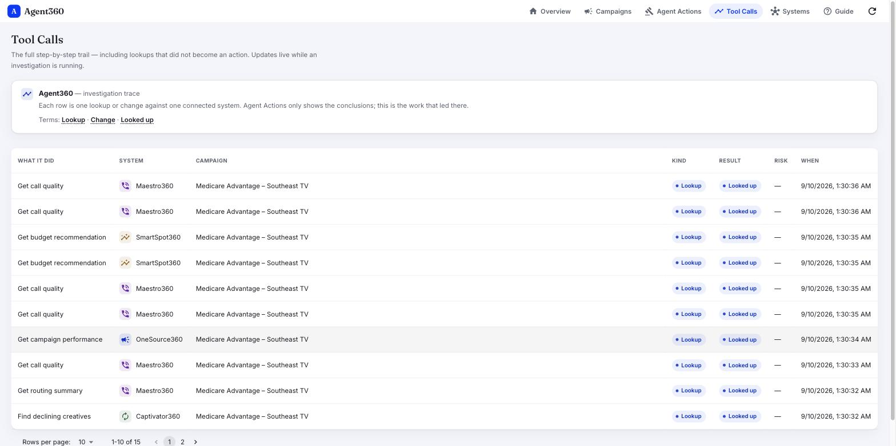

*`localhost:3000/#/tool_calls` — this is not a replay. This screen updated live, in this order, while the investigation above was running. 15 rows, all reads — nothing here changed any data yet.*

**The synthesis**, based on the real numbers above:

> Campaign 1's cost-per-lead spike is not a media-buying problem — TV spot performance is steady across both stations and dayparts, with an even 28/28 sample split and no shift in average CPL. The real drivers are two compounding issues that both line up with the same date, August 22: the campaign's only active creative (CR-114) has gone stale, with click-through rate down 25.1% from its own baseline; and simultaneously, the share of calls routed to a non-certified agent pool — which converts at roughly half the rate of the certified pool — nearly quadrupled, from 9.5% to 35.6%. Spend held flat the entire time, so this is a "fewer, lower-quality leads for the same money" problem, not an overspend problem. Fixing either issue alone would help; fixing both is what actually gets the campaign back near target.

**Why this matters:** neither the creative decline nor the routing shift alone explains a ~50% cost jump. Together they do — and no single platform's own dashboard shows this, because the answer lives at the intersection of two systems that have never been checked side by side before.

**If Claude only summarizes without making enough tool calls**, ask: *"Use the Agent360 tools — don't rely on memory from a prior session."*

### A real miss, kept in rather than edited out

The first pass at this step asked `get_call_quality` for the *entire* 35-day campaign history in one call, rather than the narrow early/late comparison windows above. The call **completed successfully on the server** — logged to the audit trail as `read_ok`, same as every other row — but the client never got to see the result: the raw event dump was thousands of call records, and the connection dropped mid-stream (`SSE stream ended without a response`) before it could finish arriving.

This is worth keeping in for exactly what it demonstrates: **the audit trail is server-side truth, independent of whether the calling client survives the round trip.** A tool that returns nothing to the caller is not the same as a tool that never ran. The practical fix is the one already reflected in the table above: ask this tool for the specific narrow windows you actually want to compare (a few days each), not a full campaign history in one shot.

---

## Step 4 — Ask it to act, and watch three different outcomes happen

This is the core of the pitch. Paste this next:

> Now submit actions through Agent360 write tools so we can see risk routing:
> 1. A **small** budget reallocation — well under 5% of baseline weekly spend (should auto-execute).
> 2. A **larger** budget reallocation — roughly a quarter to a third of baseline weekly spend, *not* the full recommended amount (should need approval).
> 3. A creative refresh for CR-114 / creative_id 1 (should be blocked — it's the campaign's only active creative).
>
> Approve any Claude Code permission prompts. Do not skip the write tool calls.

Then switch back to the browser and refresh **Agent Actions** (`http://localhost:3000/#/agent_actions`). On this run, three rows landed like this:

| Write tool call | Sizing | Risk score | Outcome | What to say |
|---|---|---:|---|---|
| `reallocate_budget` (rec #22) | $1,200 · 2.4% of weekly spend | **1.67** | **Auto-executed** | "This just happened on its own. It was small, well-supported by data, and under the hard cap — but it's fully logged, not silently applied." |
| `reallocate_budget` (rec #23) | $12,000 · 23.9% of weekly spend | **37.71** | **Pending approval** | "This one's bigger, so it's waiting for a person. Read the reasoning — it's written for a business user, not an engineer." |
| `request_creative_refresh` (CR-114) | campaign's sole active creative | **91.0** | **Blocked** | "This would've left the campaign with zero active creatives. The system refused it outright and explained why, before a person ever had to catch it." |

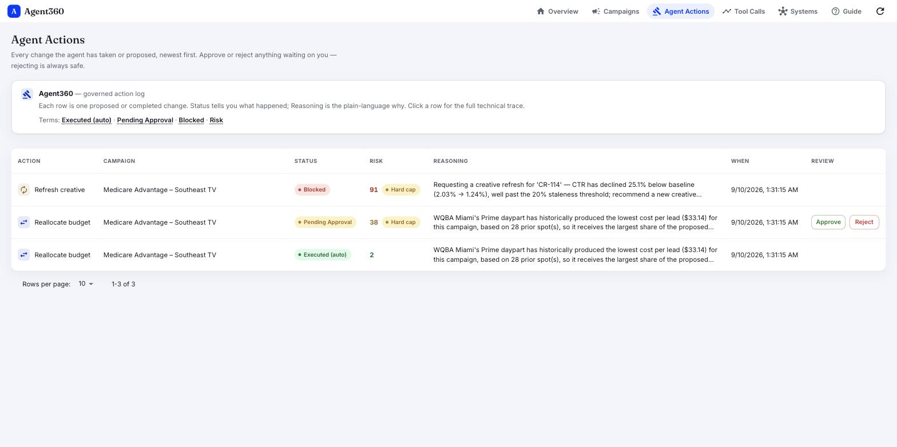

*`localhost:3000/#/agent_actions` — Executed (auto) at risk 2, Pending Approval at risk 38, Blocked at risk 91, with live Approve/Reject buttons on the row waiting for a human.*

**Why the numbers land where they do.** Every write tool is scored on a 0–100 scale — weighted 50% magnitude, 35% confidence, 15% recency — then multiplied by a regulatory factor for sensitive verticals, with a hard cap that can independently force a decision below auto-execute regardless of the score:

| Constant | Value |
|---|---:|
| `AUTO_EXECUTE_THRESHOLD` | 30 |
| `BLOCK_THRESHOLD` | 70 |
| `REALLOCATE_BUDGET_HARD_CAP_PCT` | 5.0% |
| `REGULATORY_MULTIPLIER` (medicare_advantage) | 1.4× |
| `RECENCY_WINDOW_HOURS` | 24h |

The $12,000 reallocation is a good worked example: magnitude 23.87 (well over the 5% hard cap, so it can never auto-execute no matter how well-supported), confidence contributes 0 (fully backed by historical data), recency contributes 100 (a fresh proposal) → base score `0.5×23.87 + 0.15×100 = 26.93` → final score `26.93 × 1.4 = 37.71`. Above the auto-execute floor, below the block ceiling — pending approval, exactly as intended. The hard cap alone doesn't force a block; it only forces the decision *out of* auto-execute. Blocking still requires crossing 70, which is what the creative refresh's score of 91 does.

Now click **Approve** on the pending row, live, right there in the browser.

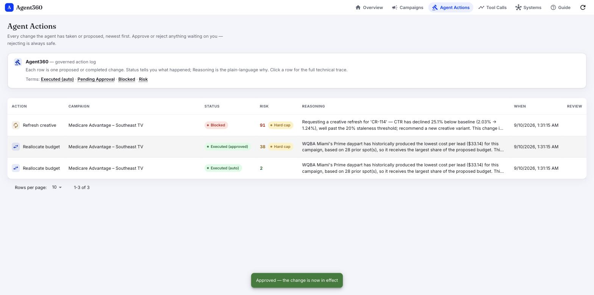

*Clicking **Approve** — the toast confirms the write actually landed ("the change is now in effect"), not just a status label flipping.*

**Why this matters (the headline point):** notice that Approve button lives in this console, not in Claude Code. The agent can propose all day; nothing above the low-risk tier can execute without a person clicking a button in a UI the agent has no access to. That's an architectural fact, not the model politely waiting to be asked.

**A heads-up, in case it happens to you too:** the second call is deliberately worded to land in the middle ("roughly a quarter to a third," not "the full recommendation"). Asking for the *full* recommended amount instead sizes the request at 100% of weekly spend, and on a regulated campaign like this one that reliably lands on **Blocked** instead of **Pending** — see [Something didn't go as expected](#something-didnt-go-as-expected) below. It's not a bug; it's the guardrail doing exactly its job on too large an input.

---

## Step 5 — Check the full paper trail

Click **Tool Calls**.

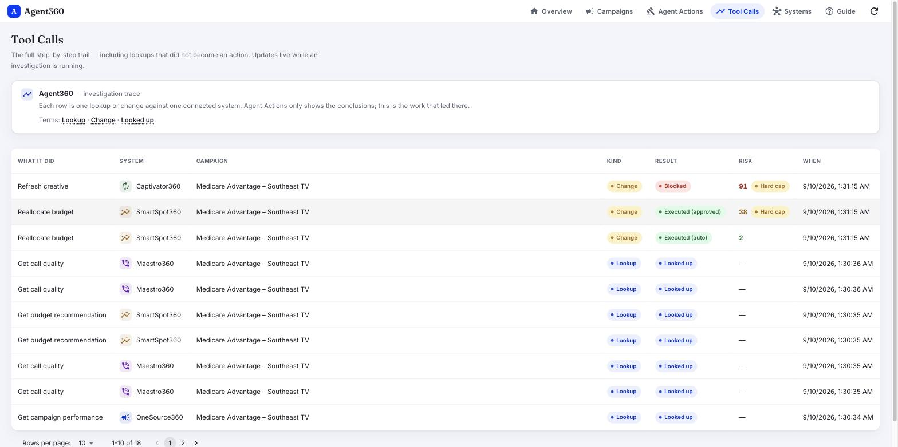

*`localhost:3000/#/tool_calls` — 18 of 18 real calls: the 15 reads from the investigation plus the 3 writes, nothing pruned for the demo, every check timestamped whether it succeeded or not.*

Click any row, then open its **Technical trace**.

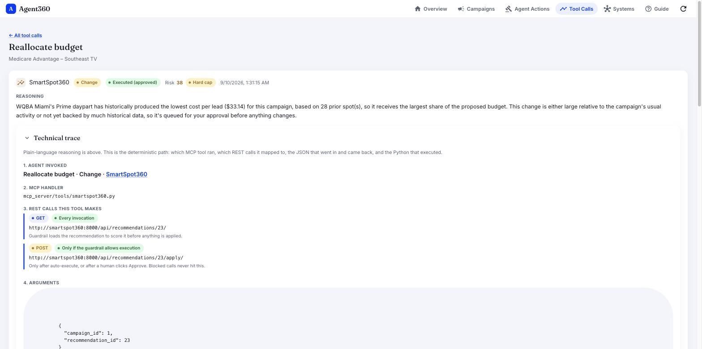

*It reconstructs the whole path: which MCP tool ran → which file handles it (`mcp_server/tools/smartspot360.py`) → the exact REST call(s) it makes, with the condition each one fires under (`GET .../recommendations/23/` on every invocation to score the proposal; `POST .../recommendations/23/apply/` only if the guardrail allows execution — blocked calls never reach this line) → the arguments it received → the result it returned.*

**Why this matters:** this is full auditability, not just of what changed but of everything the agent looked at getting there. It's the difference between "trust the agent's summary" and "here's the actual transcript, plus the code that produced it" — available to anyone who wants to check the agent's reasoning instead of taking it on faith.

---

## Wrap-up: what to leave the room with

If you only have time for one closing thought, use the sentence from the top. If you have a moment for more, these are the six things worth landing explicitly:

1. **Governance lives outside the model.** A deterministic scoring function decides how much autonomy an action gets — the agent doesn't grant itself permission.
2. **Three tiers, not one gate.** Auto-execute, human approval, and hard block, calibrated per action — not one repetitive "please approve everything" loop that trains people to click yes without reading.
3. **A hard cap that can't be argued past.** It's independent of the score itself — defense in depth against a bug in the scoring math, not just the math being right on average.
4. **It's vendor-agnostic by construction**, not by policy. None of this logic lives in Claude Code — swap it for any MCP-compatible agent and nothing about the safety behavior changes.
5. **The extensibility story is real, not aspirational.** A new backend system can join as one small adapter and a config line — see the RankPulse onboarding below, done live for this very document.
6. **Every decision traces to real code, not a black box.** Every tool call, REST request, and risk score resolves to a file and function you can actually open — the Systems pages render the handler and guardrail source directly, live off disk, not a description of what they do (see "The actual code, not a description of it" under Going further).

---

## Going further

Each of these stands alone — use whichever fit your audience, in any order, after Step 5. All four were actually run live for this document; none are hypothetical.

### Systems drill-down (~3 min)

Open **Systems → SmartSpot360**, then the **Spots explorer** link to see the raw airings behind the "media buy didn't change" negative evidence from Step 3 — one row per station/daypart/date, with the spot-level CPL the recommendation engine scores against:

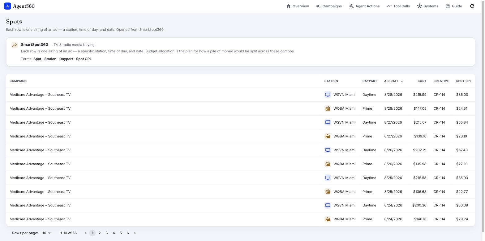

*`localhost:3000/#/spots` — WSVN Miami/Daytime and WQBA Miami/Prime, the same two station/daypart combos `get_spot_performance` and `get_budget_recommendation` reason over in Step 3 and Step 4. Nothing here shifts week to week, which is exactly why SmartSpot360 gets ruled out as a cause.*

Open **Systems → Captivator360**, then the **Creatives explorer** link to see CR-114's daily click-through rate falling:

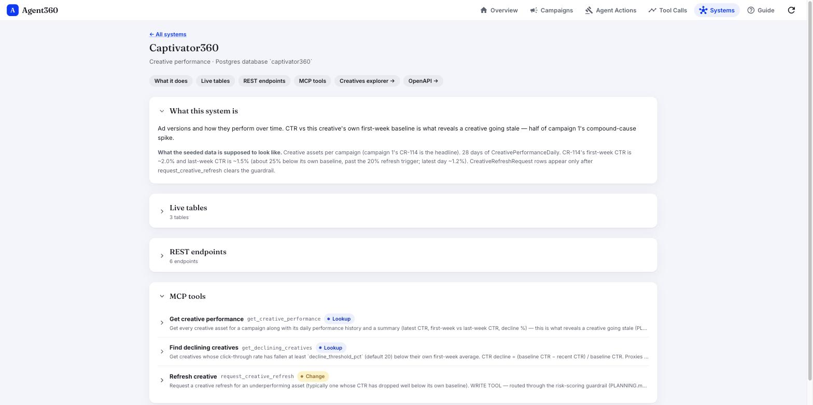

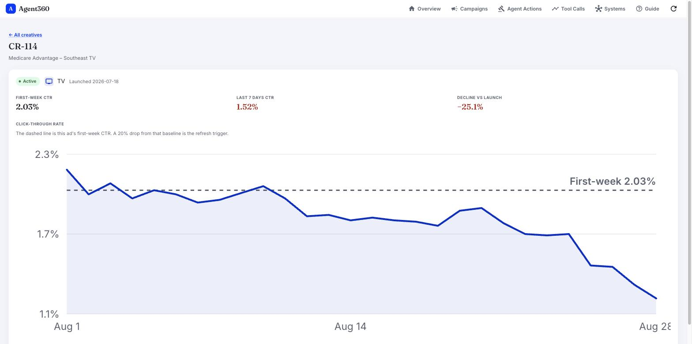

*`localhost:3000/#/creatives/1/show` — first-week CTR 2.03% against a dashed baseline; last-7-days CTR down to 1.52%, a −25.1% decline. The refresh trigger is a 20% drop from that same baseline.*

Then **Systems → Maestro360** and its **Call Routing explorer** for the weekly chart of the routing shift:

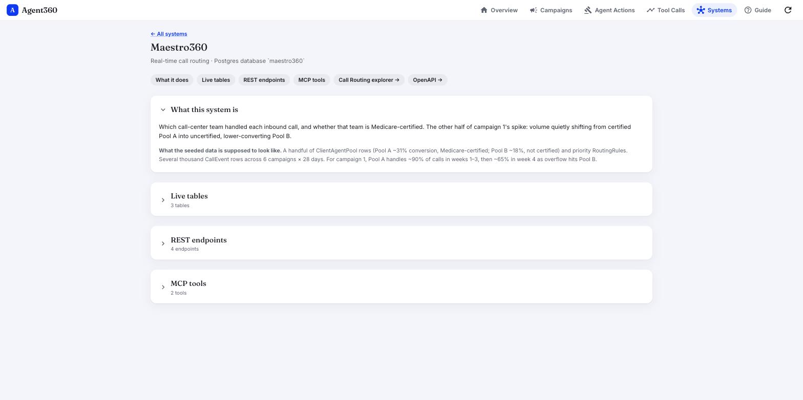

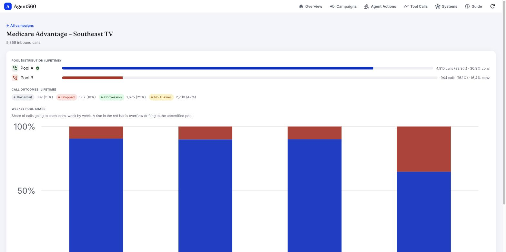

*`localhost:3000/#/call_routing/1/show` — the red share of each weekly bar is overflow drifting to the uncertified pool. Weeks 1–3 sit near 0%; week 4 jumps to roughly a third of all calls. This is the single most direct visual proof of the "quietly shifting" finding.*

Worth mentioning: Medicare certification status is a first-class fact in this data, and it feeds directly into the risk score — regulated verticals get a stricter threshold automatically.

### The actual code, not a description of it (~2 min)

Everything so far has been data — real, but still one layer removed from the code that produced it. This closes that gap. Open **Systems → Agent360 Gateway**, expand **MCP tools**, and scroll past the thresholds line:

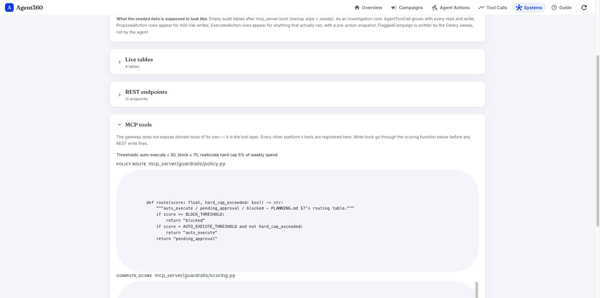

*`localhost:3000/#/systems/agent360` — not a diagram of the guardrail logic, this is `mcp_server/guardrails/policy.py`'s actual `route()` function, read off disk and rendered as-is. Scroll a little further on the live page and `compute_score()` from `scoring.py` sits right below it — the same two functions that produced every outcome in Step 4.*

Every individual tool carries the same pairing. Open any **Systems** page, expand **MCP tools**, and click into one tool:

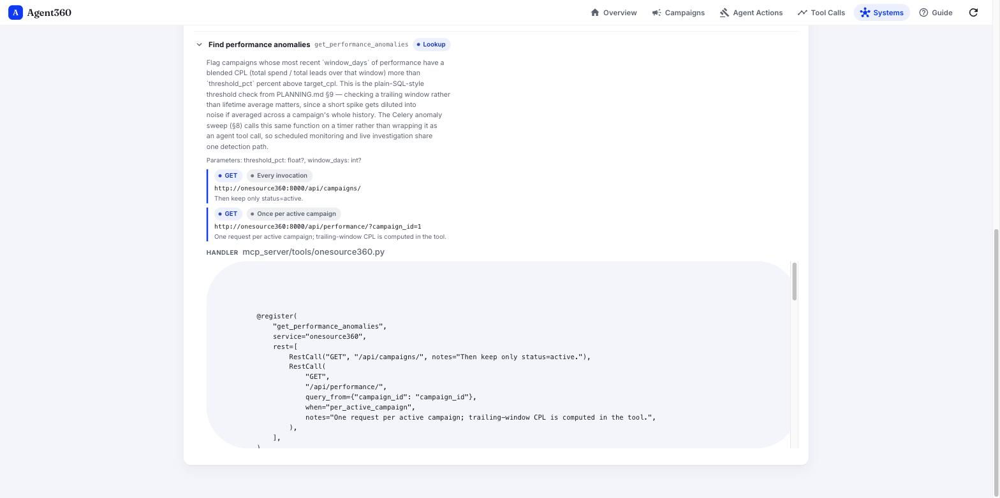

*`localhost:3000/#/systems/onesource360` — `get_performance_anomalies`'s description, the exact REST call(s) it issues and the condition each fires under, then directly beneath both, the real `@register(...)`-decorated Python from `mcp_server/tools/onesource360.py`. Nothing on this page is a summary written about the code — it's the file.*

**Why this matters:** most "explainable AI" demos stop at a natural-language summary and ask you to trust it. This goes one level further — every claim on a Systems page (which endpoint got hit, what a tool actually checks, how a risk score gets computed) is independently checkable against the exact source file a reviewer would open in an editor or `git blame`. That includes the guardrail's own decision logic, not only the domain tools it governs — the thing enforcing safety is exactly as inspectable as the thing being governed. This is the same principle as Step 5's technical trace, pushed one level deeper: the trace tells you which code ran; this is that code.

### One query, four systems (~2 min, technical audiences)

Open `http://localhost:8100/graphql` and run:
```graphql
query {
  campaignInvestigation(campaignId: 1) {
    name
    windowCpl
    cplVariancePct
    flagged
    spotCount
    latestCtrDeclinePct
    decliningVariantLabels
    uncertifiedPoolPct
    poolDistribution { poolName isCertifiedMedicare pctOfTotal }
  }
}
```

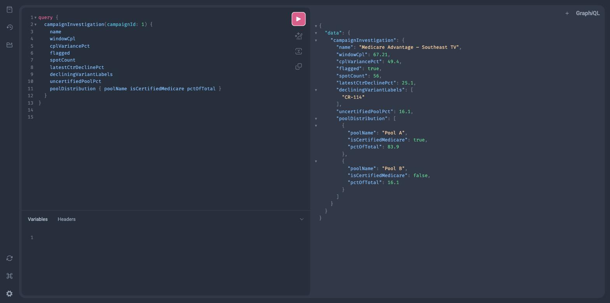

One round trip, one query, data from all four systems joined server-side. Every number cross-checks the investigation above — $67.21 CPL, +49.4% variance, CR-114 at −25.1% CTR decline, Pool B at 16.1% lifetime share — proof the gateway is a real API surface, not only a chat wrapper.

### Simulate a new day (~2 min)

The Overview page's **Simulate next day** section has an **Advance one day** button — the same path each platform uses for an overnight data drop, rather than static seeded history alone.

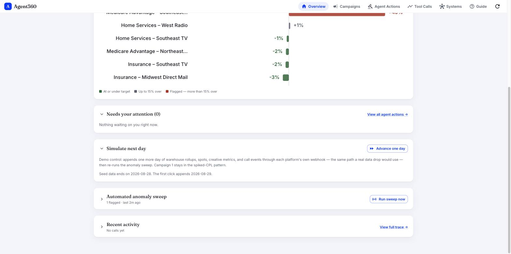

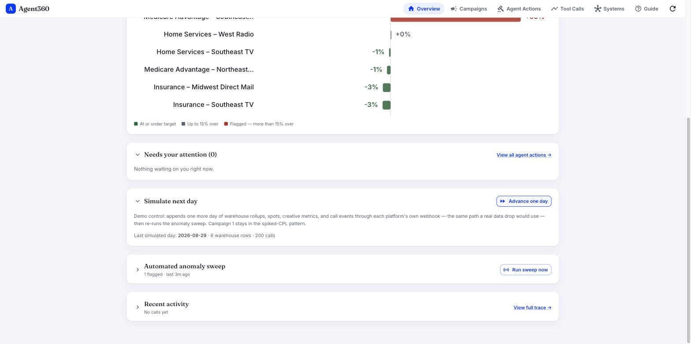

*One click appended a full new day (2026-08-29) — 6 warehouse rollup rows and 200 call events — through each platform's own webhook receiver, exactly the path a real data drop would use, then re-ran the anomaly sweep automatically. Campaign 1 stayed in its spiked-CPL pattern; the other five campaigns' variances shifted by a point or two, as real day-to-day noise would.*

**Heads up if you demo this live:** unlike `docker compose restart mcp_server` (which only wipes the audit trail), this appends a real row to each sim service's own database — it persists until you restart those four containers, which re-runs their `seed_data` command and rebuilds the pristine 28-day baseline (`docker compose restart onesource360 smartspot360 captivator360 maestro360`, then `docker compose restart mcp_server` to re-sync the gateway's own sweep).

### Reject a pending action, live (~2 min)

Steps 1–5 above are one continuous run, preserved as-is. This section and the next were captured in a later pass on the same environment, without a reset — to show two things the original run never exercised: the **Reject** button, and what Overview looks like once there's real activity behind it. Numbers here (a $15,000 reallocation, not Step 4's $12,000) are genuinely different, because this is a fresh proposal, not a replay of the same one.

A mid-size reallocation on campaign 1 landed in the pending tier the same way Step 4's did, with **Approve** and **Reject** both live on the row — in Agent Actions, and in Overview's "Needs your attention":

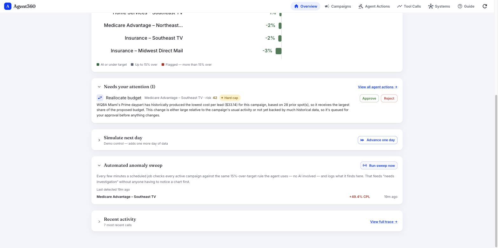

*A $15,000 reallocation scored 42 — hard cap exceeded (same reason Step 4's $12,000 example crossed into pending: over 5% of baseline weekly spend), confidence and recency otherwise clean. Reject sits right next to Approve, not hidden in a submenu.*

Click **Reject** instead of Approve this time:

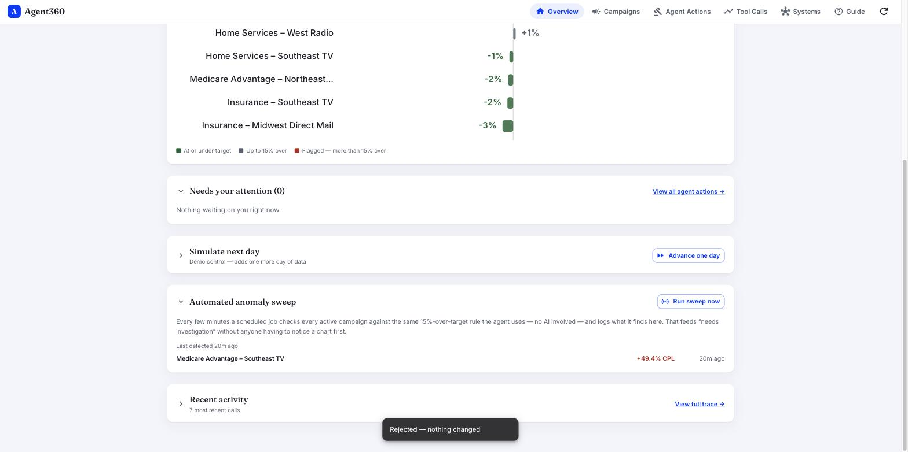

*The toast says it plainly: "Rejected — nothing changed." "Needs your attention" drops to zero.*

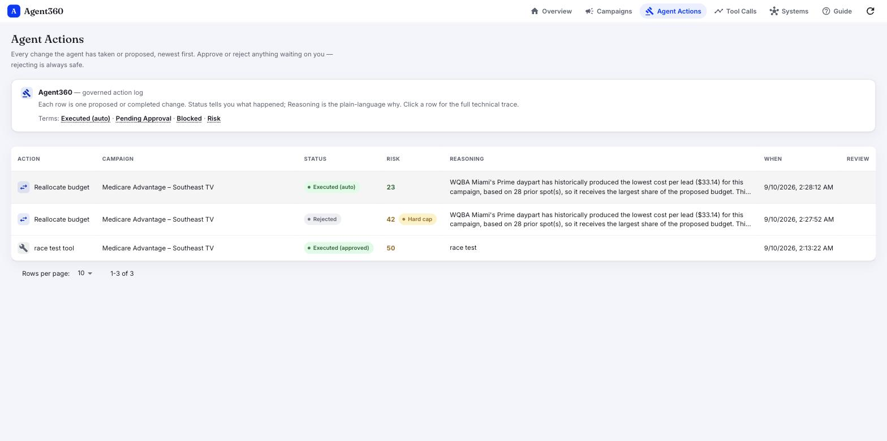

*`localhost:3000/#/agent_actions` — the row stays in the list with a `Rejected` status and its risk score; it isn't deleted, and it no longer carries live buttons. (The third `race test tool` row here is unrelated background verification from other work running on this same environment, not part of the demo scenario — left visible rather than cropped out, the same "don't edit out what actually happened" practice as the transport-hiccup note in Step 3.)*

**Why this matters:** "rejecting is always safe" (`docs/for-marketers.md`, the in-app Guide) isn't just a line of copy — clicking it live shows exactly what it claims: the proposal is declined, nothing about the campaign or its data changes, and it's still logged for the record.

Overview rolls the same event up automatically, no separate refresh needed:

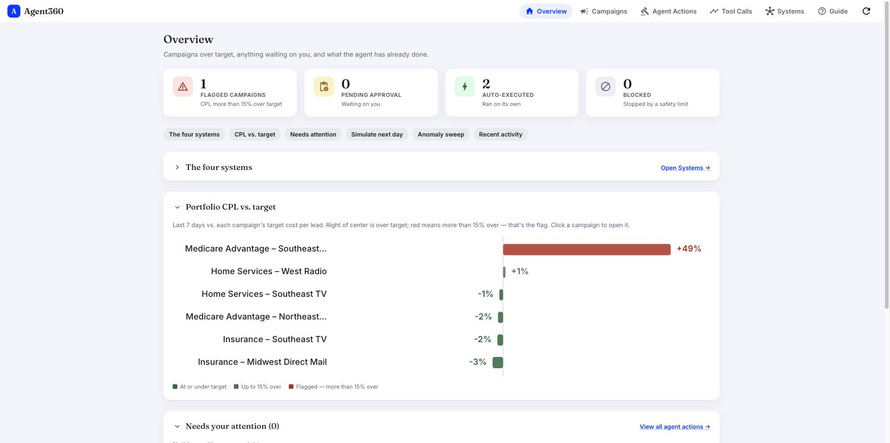

*Pending approval back to zero, auto-executed still counted, nothing blocked. Compare against Overview's very first screenshot at the top of this document — same dashboard shape, now reflecting real activity instead of a freshly-reset one.*

### Run the anomaly sweep on demand (~1 min)

Overview's "Automated anomaly sweep" section has a **Run sweep now** button — the same detection logic Celery beat runs unattended every 5 minutes (`docs/learning/04-celery-and-async.md`), triggered on demand instead of waiting for the next tick.

Click it. On an environment where nothing's changed since the last sweep, the response looks like this:

```json
{"threshold_pct": 15.0, "window_days": 7, "anomalies_found": 1, "newly_flagged": []}
```

**Why this matters, and why nothing visibly changes:** the sweep *did* run — `anomalies_found: 1` confirms it re-checked every campaign and found the same real anomaly — but `newly_flagged` is empty because campaign 1 is already flagged at that exact variance, and the sweep is deliberately idempotent (it dedupes by `(campaign_id, variance_pct)` before inserting, so clicking this — or the real timer firing every 5 minutes, forever — can't pile up duplicate rows against unchanged data). For a visible new row, run **Advance one day** first: that changes the underlying numbers, so the next sweep has something new to report.

### Onboard a fifth platform live (~3–5 min)

The single best answer to "what happens when we acquire a company with its own tooling." RankPulse-sim runs the whole time as a real, already-running platform — it's deliberately left unregistered in the agent's tool list until one line is uncommented.

**Before:**

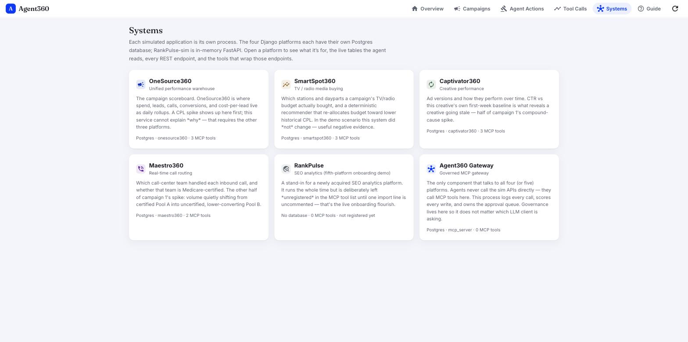

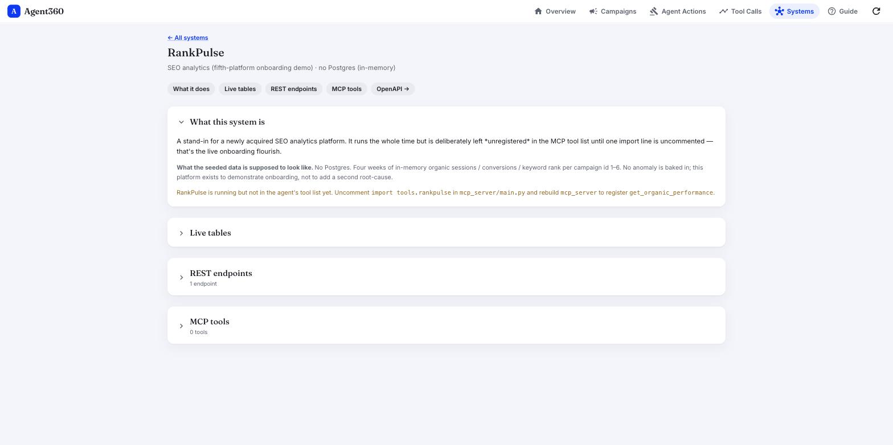

*The system's own detail page names the exact fix: uncomment `import tools.rankpulse` in `mcp_server/main.py`, then rebuild.*

**The live steps:**
```bash
# in mcp_server/main.py, uncomment:
import tools.rankpulse  # noqa: F401

docker compose up -d --build mcp_server   # well under a minute — the image is already built once
```
Then ask Claude "what tools do you have access to now?" — or just refresh the Systems page.

**After:**

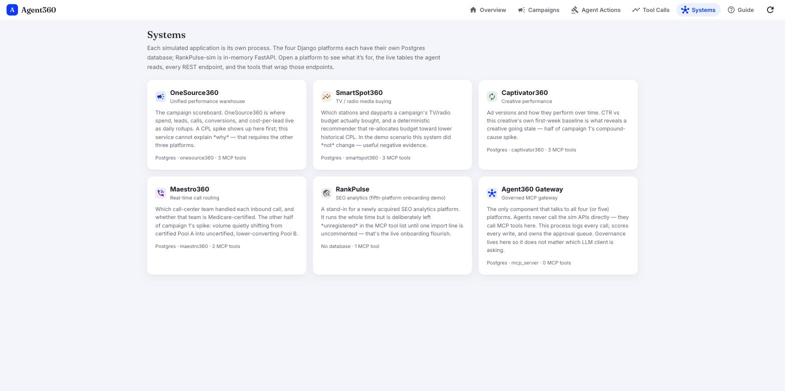

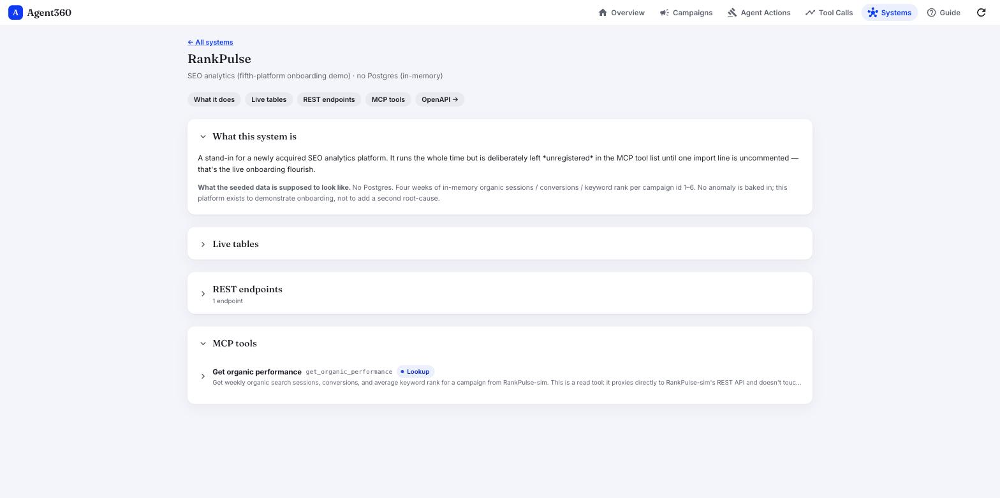

*`get_organic_performance` is live — `/tools` went from 11 entries to 12 — with zero changes to the gateway's core routing code, the risk-scoring engine, or any other platform's adapter.*

Afterward, re-comment the import and rebuild, so the next demo still has a genuine "not yet onboarded" moment. (This document's own repo state has already been restored this way — the live moment above is real, but the checked-in code is back to "not yet onboarded" for your next run.)

### Cursor as a second client

The same MCP server is already configured for Cursor in `.cursor/mcp.json`. Re-run the investigation there to show governance doesn't care which vendor's agent is asking — none of the safety logic lives in the client.

---

## Frequently asked questions

### Questions people watching might ask

**Can it spend money without anyone knowing?**
Only under the auto-execute threshold *and* the hard cap — and even then, it's logged the instant it happens, with a snapshot of what things looked like right before the change, so it can always be reviewed after the fact.

**What if the model recommends something wrong?**
Its job is to propose and explain, not to grant itself execution rights above the low-risk tier. A bad large proposal lands in the approval queue or gets blocked — the same way a bad proposal from a junior analyst would go through review before anything changes.

**What happens if you switch to a different AI vendor?**
Nothing, on the governance side — none of it is implemented in the agent, all of it is implemented in the gateway. Cursor working against the same server is the concrete proof of this, not just a claim.

**Can this be made stricter, or turned off?**
The auto-execute, approval, and block thresholds are configurable policy values, not constants baked into the agent — the business sets the dial.

**How much does this cost to run?**
$0 for the core system — it runs on infrastructure you already have (an existing Claude or Cursor subscription, and local Docker).

**What's actually novel here versus "just calling an LLM with some APIs"?**
Any system can call tools. The risk-scored, three-tier autonomy model — with a score-independent hard cap and pre-action snapshotting for audit — is the part that answers "how do you deploy this responsibly," which is the actual blocker to letting an agent touch production systems at all.

### Something didn't go as expected

**Nothing showed up in Agent Actions after Step 4.**
Claude Code likely blocked the write tools with its own permission prompt before Agent360 ever saw them. Approve the prompts and ask again.

**Claude Code can only see one or two Agent360 tools, not eleven.**
This is the MCP tool-list caching gotcha from [Before you start](#before-you-start) — the client fetched its tool list before the server had everything registered (often right after a restart or rebuild). Start a brand-new Claude Code session rather than debugging the server; a fresh session's first handshake picks up the full list.

**One of the actions blocked when I expected it to need approval.**
This is the known trap from Step 4: asking for "the full recommendation" (about 100% of weekly spend) rather than "roughly a quarter to a third" clamps the risk score's magnitude term to its maximum. On a Medicare Advantage campaign, that alone — `0.5 × 100 magnitude × 1.4 regulatory multiplier = 70` — already equals the block threshold, before confidence or recency even add anything. Ask Claude to try a smaller amount, explicitly "about a quarter of weekly spend, not the full recommendation," and it will land on pending approval instead. (Verified on an earlier run: $1,200 scored 1.67 → auto; $12,000 scored 37.71 → pending; $50,345, the full amount, scored 91.0 → blocked.)

**The creative refresh didn't get blocked.**
Confirm it actually called `request_creative_refresh` against campaign 1's sole active creative (CR-114 / creative_id 1) — the block only fires because refreshing the campaign's *only* active creative would leave nothing running.

**A read tool call seems to hang or error out with no result.**
If it's `get_call_quality` over a wide date range, this is the real transport miss documented in Step 3 — the server likely still completed and logged the call (check `localhost:3000/#/tool_calls`), it just didn't make it back to the client in one piece. Ask for a narrower window instead.

**The page looks stale, or a URL takes me to the wrong screen.**
Hard-refresh, and check for the `#` in the URL — without it, a typed or bookmarked link silently lands on the Overview dashboard instead.

**A container isn't healthy.**
`docker compose ps` to see which one, `docker compose logs <service> --tail 50` to see why. Avoid restarting mid-demo unless you have to — a visibly broken tab you can talk past is usually less disruptive than a restart.

**I need to reset and start over.**
`docker compose restart mcp_server` wipes the audit trail and re-flags the campaign fresh, same as the "before you start" step. If you've also clicked **Advance one day**, restart the four sim containers first (`docker compose restart onesource360 smartspot360 captivator360 maestro360`) to rebuild the pristine 28-day baseline before restarting the gateway.

**I'm genuinely stuck live.**
Narrate from `docs/for-marketers.md` — it has exact numbers from a full prior real run, works with no internet connection, and means you're never fully unscripted even if the live environment misbehaves. The in-app **Guide** tab (`localhost:3000/#/faq`) covers the same ground for a non-technical audience without leaving the app.

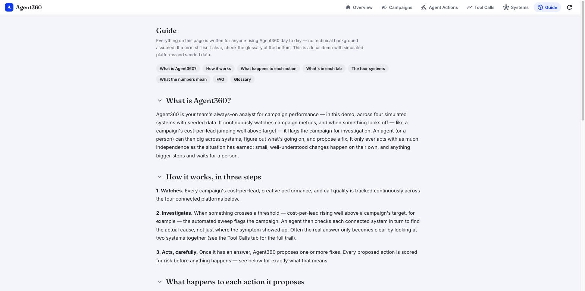

---

## Cheat sheet

| What | URL / command |
|---|---|
| Console | http://localhost:3000/#/ |
| Agent Actions | http://localhost:3000/#/agent_actions |
| Tool Calls | http://localhost:3000/#/tool_calls |
| Systems | http://localhost:3000/#/systems |
| Creatives explorer | http://localhost:3000/#/creatives |
| Call Routing explorer | http://localhost:3000/#/call_routing |
| In-app Guide | http://localhost:3000/#/faq |
| GraphQL | http://localhost:8100/graphql |
| Health / tools / catalog | http://localhost:8100/health · `/tools` · `/catalog` |
| Start the stack | `docker compose up -d` |
| Rebuild the gateway | `docker compose up -d --build mcp_server` |
| Reset audit trail + re-flag | `docker compose restart mcp_server` |
| Reset sim data to pristine 28-day baseline | `docker compose restart onesource360 smartspot360 captivator360 maestro360` |
| Trigger the anomaly sweep manually | `curl -X POST http://localhost:8100/flagged-campaigns/sweep` |
| Advance one simulated day | Overview page → **Advance one day**, or `curl -X POST http://localhost:8100/simulate-next-day` |
| Connect Claude Code | `claude mcp add --transport http agent360 http://localhost:8100/mcp` |
| Onboard RankPulse live | uncomment its import in `mcp_server/main.py` → rebuild `mcp_server` |
| Run the test suite | `cd mcp_server && pytest` |
| Fallback numbers, works offline | `docs/for-marketers.md` |

---

## Screens at a glance

Everything above shows each screen once, in the order you'd actually use it during a live run. These four are real screenshots from this same environment that just didn't fit that narrative — included here so reading this document alone still gives a full picture of what's in the console, even if you never click through it yourself.

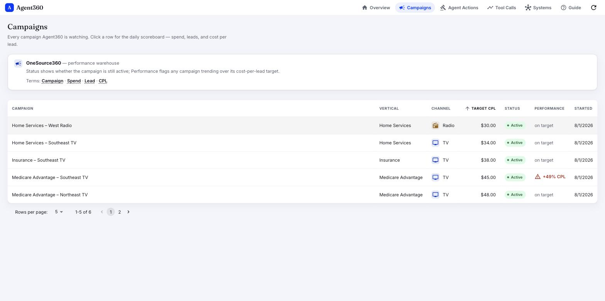

*`localhost:3000/#/campaigns` — all six seeded campaigns. Only "Medicare Advantage – Southeast TV" carries a flagged badge; the rest read "on target."*

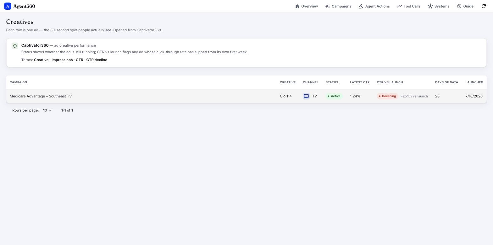

*`localhost:3000/#/creatives` — one row per creative asset across every campaign. CR-114 is the only one seeded, already shown declining. Its Show page is screenshot 11, above.*

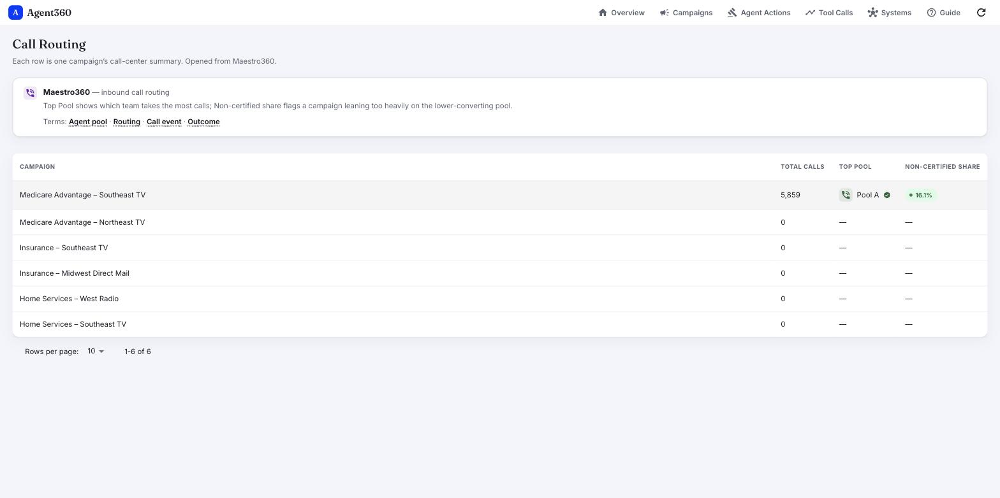

*`localhost:3000/#/call_routing` — one row per campaign's call-center summary. Only campaign 1 has seeded call data; the other five show "—" across the board. Its Show page is screenshot 13, above.*

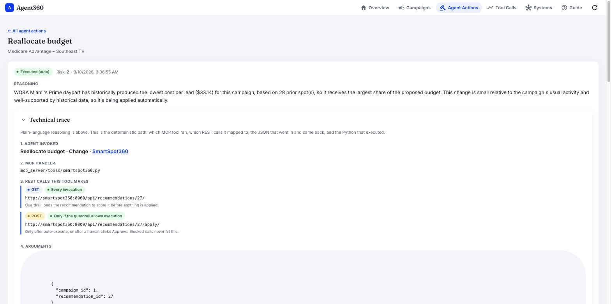

*`localhost:3000/#/agent_actions/3/show` — clicking any Agent Actions row and expanding Technical trace shows the same deterministic path as the Tool Calls trace (screenshot 9): which tool ran, which file handles it, the exact REST calls, and the guardrail's own reasoning for this specific write. This one is a fresh $1,500 reallocation on campaign 1 — small enough to auto-execute (risk score 2.09), generated live for this section on a freshly reset environment.*

---

*Numbers and screenshots above come from real runs on 2026-09-10 against the seeded demo data — Steps 1–5 from one continuous pass, the Reject and anomaly-sweep additions under Going Further from a later pass on the same environment, without a reset in between. "The actual code, not a description of it" (screenshots 27–28) was captured in a third pass, right after a full `docker compose restart` of the sims and the gateway — visible in screenshot 27 itself, where the gateway's own "what the seeded data is supposed to look like" text reads "empty audit tables after mcp_server boot." Screens at a glance (screenshots 29–32) came from a fourth pass on that same reset environment — the Agent Actions technical trace shot required one real write call (the $1,500 auto-execute reallocation described in its caption) issued directly through the MCP tools, not through Claude Code's own investigation flow, to have something real to click into. Run any of it again and you'll see the same numbers for a given input — the scoring is deterministic (re-running the full investigation and write sequence twice on this same day produced identical risk scores down to two decimal places) — but your own screenshots and Tool Call timestamps will be new. That's the point: this document is a record that the walkthrough works, not a substitute for running it live.*
